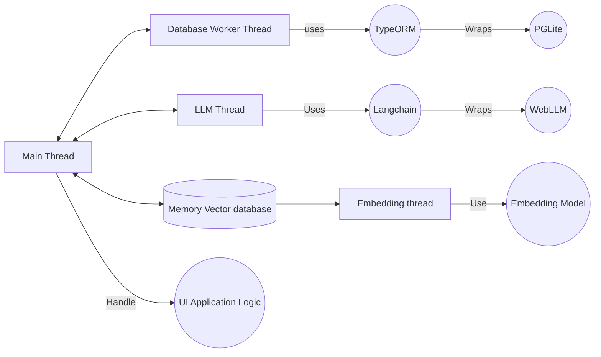

# NoLLM Chat

The project aims to revolutionize AI interaction by creating a platform that enhances traditional LLM experiences. It strives to simplify the exploration of AI technologies directly within web browsers, providing a versatile and visual interface. The objective is to enable users to interact with language models in a manner that boosts creativity and enriches their experience, going beyond basic chat interactions.

## Intro

[](https://app.netlify.com/sites/nollm/deploys)
<p align="center">
    <a href="https://nollm.netlify.app/NoLLMChat">✨✨✨ DEMO ✨✨✨</a>
</p>
<p align="center">
    [■■■■□□□□□□] 30%
</p>


## Vision

* **Enhanced AI Interaction**: Move beyond traditional LLM chat with a platform offering a more flexible and visual interface. Users can directly edit and guide AI to improve response quality, enabling richer interaction experiences.

* **Automated Personal Workflows**: Empowers users to create custom AI workflows tailored to their needs, enhancing productivity and personalization.

* **Comprehensive AI Learning**: Utilize node-based tools that facilitate interaction with and learning about AI technologies. The platform supports LLMs, prompt engineering, function calls, and vector databases, allowing users to experiment and see the impact of different AI components.

* **Free and Browser-Based**: Operates locally and free of charge, with the option to extend capabilities using services like OpenAI. This ensures accessibility and ease of use directly from the browser.

## Project Structure

```
src/
│
├── assets/         # Static assets like images and fonts
├── components/     # Reusable React components
├── constants/      # Constant values and configuration settings
├── contexts/       # React context providers for global state management
├── css/            # Styling files (CSS or preprocessor files)
├── hooks/          # Custom React hooks
├── i18n/           # Internationalization setup and resources
├── lib/            # Utility libraries and third-party integrations
├── pages/          # Page components for different routes
├── services/       # API calls and service functions
├── states/         # State management files (e.g., Zustand)
├── utils/          # Utility functions and helpers
│
├── App.tsx         # Main application component
├── main.tsx        # Entry point of the application
└── routes.tsx      # Route configurations
```

## Project Architecture

The architecture of the application is designed to efficiently handle different tasks by dividing them into separate threads. This ensures smooth operation and responsiveness of the UI while managing complex processes in the background.

* Main Thread: Handles the UI application logic, ensuring a responsive user interface.
* Database Worker Thread: Manages database operations using TypeORM and PgLite. This thread is responsible for data storage and retrieval without blocking the main UI thread.
* LLM Thread: Dedicated to handling large language model processes using WebLLM and Langchain. This thread manages AI computations and interactions.
* Embedding Thread: Focuses on handling the vector database and embedding models. It processes and manages embeddings for efficient data retrieval and manipulation.



## Libraries and Tools

- **[Vite](https://vite.dev/)**: Fast and modern build tool for web projects.
- **[React](https://react.dev/)**: A popular JavaScript library for building user interfaces.
- **[ReactFlow](https://reactflow.dev/)**: A library for building node-based applications.
- **[PGLite](https://pglite.dev/)**: A lightweight PostgreSQL client for Node.js and browsers.
- **[Voy](https://github.com/tantaraio/voy)**: A WASM vector similarity search engine written in Rust
- **[Memory Vector Database](https://js.langchain.com/docs/integrations/vectorstores/memory/)**: ephemeral vectorstore that stores embeddings in-memory and does an exact, linear search for the most similar embeddings.
- **[WebLLM](https://webllm.mlc.ai/)**: Run large language models in the browser without server dependencies.
- **[Langchain](https://js.langchain.com/docs/introduction/)**: LangChain is a framework for developing applications powered by large language models (LLMs)
- **[Langgraph](https://langchain-ai.github.io/langgraph/)**: A graph-based language model.
- **[shadcn UI](https://ui.shadcn.com/)**: A lightweight and fast state management library for React.
- **[TypeORM](https://typeorm.io/)**: An ORM that can run in NodeJS and the browser which supports SQLite WASM.
- **[Tailwind CSS](https://tailwindcss.com/)**: A utility-first CSS framework for quickly building custom designs.
- **[i18next](https://www.i18next.com/)**: Internationalization framework for browser or any other JavaScript environment.
- **[React Router](https://reactrouter.com/)**: Declarative routing for React applications.
- **[Zustand](https://github.com/pmndrs/zustand)**: A small, fast, and scaleable state management library for React.
- **[ESLint](https://eslint.org/)**: A pluggable and configurable linter tool for identifying and reporting on patterns in JavaScript.
- **[Prettier](https://prettier.io/)**: An opinionated code formatter that ensures consistent code style.
- **Components**: [magicui](https://magicui.design) and [kokonut](https://kokonut.dev)

## Getting Started

To get started with the Project, follow these steps:

1. **Clone the Repository**: 
   ```bash
   git clone git@github.com:zrg-team/NoLLMChat.git
   ```
2. **Install Dependencies**:
   ```bash
   cd NoLLMChat
   yarn install
   ```
3. **Run the Development Server**:
   ```bash
   yarn dev
   ```
4. **Open in Browser**: Visit `http://localhost:PORT` to start interacting with the AI assistant.

## Contributing

We welcome contributions from the community! Whether it's bug fixes, new features, or documentation improvements, your help is appreciated. Please check our [contribution guidelines](https://github.com/zrg-team/NoLLMChat/blob/main/CONTRIBUTING.md) for more information.

## License

This project is licensed under the MIT License. See the [LICENSE](https://github.com/yourusername/ai-web-assistant/blob/main/LICENSE) file for more details.

## Contact

For questions, feedback, or suggestions, feel free to open an issue on GitHub or contact us at [zerglingno2@outlook.com](mailto:zerglingno2@outlook.com).
